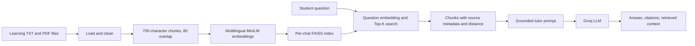

# Personal Tutor Platform from Learning Documents

**แพลตฟอร์มติวเตอร์ส่วนบุคคลจากเอกสารการเรียน** เป็นเว็บแอป RAG สำหรับนักเรียน นักศึกษา และผู้เรียนที่ต้องการถาม อธิบาย สรุป หรือทบทวน Computer Networks และ Cybersecurity โดยใช้เอกสารใน `data/documents/` เป็นแหล่งความรู้เพียงแหล่งเดียว

## Objectives and Features

- Ask questions, request explanations and summaries, compare concepts, define terms, and generate review questions from course notes.
- Load UTF-8 `.txt` notes and text-based PDFs, clean whitespace, and retain `filename`, `source`, `document`, `topic`, `start_index`, `chunk_id`, and PDF page metadata.
- Split notes into 700-character chunks with 80-character overlap. Paragraph and sentence separators preserve readable units; overlap carries a small amount of context across boundaries without making chunks excessively repetitive.
- Embed chunks and questions with `sentence-transformers/paraphrase-multilingual-MiniLM-L12-v2`, a compact multilingual sentence model suitable for English and Thai text and a CPU-based Streamlit deployment.
- Search the FAISS index for 3–5 chunks (default 5). Five chunks provide useful context for multi-part questions while keeping the prompt bounded.
- Upload additional UTF-8 `.txt` notes or selectable-text `.pdf` documents from the Library tab; files are saved under `data/documents/` and included in the refreshed FAISS index.
- Browse the document inventory, inspect and download existing files, create a text document, or append notes to a selected document in the Documents tab.
- Display retrieved filenames, PDF page number when available, topic, chunk ID, and FAISS L2 distance. A lower distance means a closer vector match; the value is a distance, not a probability.
- Ask Groq to act as a patient tutor, answer in the question's language, cite source filenames, and refuse when context does not support an answer.
- Create multiple chats, select the allowed documents for each chat, keep separate history in `st.session_state`, and clear one chat at a time.
- Show three clickable, topic-specific example questions in every chat; each one submits the question directly.
- Use a responsive light study-workspace theme with chat controls separated from document management.

## RAG Architecture



## Dataset and Project Structure

The seven short course-note documents cover fundamentals, the OSI model, TCP/IP, IP addressing and subnets, routing, VLANs, and cybersecurity. Together they contain more than 15,000 characters for retrieval testing.

```text
.
├── app.py
├── requirements.txt
├── README.md
├── validate_project.py
├── test_questions.csv
├── .gitignore
├── .streamlit/
│   ├── config.toml
│   └── secrets.toml.example
└── data/
    └── documents/
        ├── network_basics.txt
        ├── osi_model.txt
        ├── tcp_ip.txt
        ├── ip_address.txt
        ├── routing.txt
        ├── vlan.txt
        └── cybersecurity.txt
```

`validate_project.py` checks the document set and size, CSV columns, 15 questions, and the required A–E group counts before deployment.

## Technologies and Installation

Python 3.11 is recommended. Create and activate a virtual environment, then install the listed dependencies:

```powershell
py -3.11 -m venv .venv
.\.venv\Scripts\Activate.ps1
python -m pip install --upgrade pip
pip install -r requirements.txt
```

Validate the static project inputs and launch Streamlit:

```powershell
python validate_project.py
streamlit run app.py
```

On first launch, the embedding model is downloaded from Hugging Face and the in-memory FAISS index is built. This needs network access and can take a few minutes. The index cache key includes file content hashes, so changing or adding a source document causes a rebuild. PDF loading uses `pypdf` through LangChain's `PyPDFLoader`.

## Configuration and Secrets

For local use, edit `.streamlit/secrets.toml` and replace its placeholder with a real Groq API key. The file is ignored by Git. The tracked `.streamlit/secrets.toml.example` contains only a placeholder:

```toml
GROQ_API_KEY = "YOUR_GROQ_API_KEY"
```

The real `secrets.toml` is ignored by Git. Never put a real key in source code, notebooks, CSV files, screenshots, or a public repository. If a key is exposed, revoke it and create a replacement.

## Example Questions

- `OSI Model คืออะไร?`
- `TCP และ UDP แตกต่างกันอย่างไร?`
- `ช่วยสรุปเรื่อง VLAN สำหรับเตรียมสอบ`
- `Explain the TCP/IP model.`
- `นายกรัฐมนตรีของประเทศไทยคือใคร?` (ควรปฏิเสธ เพราะไม่มีใน corpus)
- `ช่วยสร้างคำถามทบทวนเรื่อง subnetting`

Each newly created chat also shows three clickable prompts generated from the selected document topics: explain a key concept, summarize it for exam review, and generate three review questions.

## Chats and Document Selection

Use **New chat name** and **Documents for this chat** in the sidebar, then select **Create chat**. Each chat stores its own chosen filenames and message history. The retriever builds an index only from those selected files; a chat cannot retrieve chunks from documents that were not selected for it. Switch chats with **Select chat**, or use **Clear this chat** to clear only the active history. The initial **General study** chat uses all current documents and preserves the previous single-chat history when migrating.

The system prompt directs the model to use only retrieved context, respond in the question's language, cite filenames, and use a fixed refusal in Thai or English when evidence is missing. Retrieved excerpts are shown separately so the evidence can be inspected.

## Evaluation

`test_questions.csv` contains 15 cases with expected answers and sources, a result description, and a `Pass/Fail` field initially marked `Pending runtime evaluation`. Groups are A: 5 direct questions, B: 3 multi-part questions, C: 2 explanations, D: 2 English questions, and E: 3 out-of-corpus questions. Run each prompt in the app and update Result and Pass/Fail from observed answers; do not mark a result as passed without running it against the deployed model.

| Group | Count | Evaluation focus | Initial status |
| --- | ---: | --- | --- |
| A | 5 | Direct retrieval and source | Pending runtime evaluation |
| B | 3 | Evidence combined across topics | Pending runtime evaluation |
| C | 2 | Tutor-style explanation | Pending runtime evaluation |
| D | 2 | English question and answer | Pending runtime evaluation |
| E | 3 | Refusal outside the corpus | Pending runtime evaluation |

## Rubric Checklist

- [x] Learning documents and grouped test questions
- [x] Document loading, cleaning, chunking, embeddings, and FAISS search
- [x] Retrieval metadata, distances, citations, and unknown-answer prompt
- [x] Streamlit chat history, clear-chat control, and retrieved-context view
- [x] README, dependency list, and secret-safe Git ignore rules
- [ ] Run all 15 questions against a configured Groq key and record observed Pass/Fail results
- [ ] Push to the student's GitHub repository and verify no key is present
- [ ] Deploy to Streamlit Community Cloud and verify the live URL

## GitHub: Step by Step

1. Create a GitHub repository named `personal-tutor-rag` (or another available name).
2. From the project folder, initialize Git and inspect the files:

   ```powershell
   git init
   git status --short
   git check-ignore .streamlit/secrets.toml
   ```

3. Confirm that `.streamlit/secrets.toml` is ignored and that only the placeholder file `secrets.toml.example` is present. Never use `git add -f` on secrets.
4. Stage, commit, add the GitHub remote, and push the chosen branch:

   ```powershell
   git add app.py requirements.txt README.md .gitignore validate_project.py data test_questions.csv .streamlit/config.toml .streamlit/secrets.toml.example
   git commit -m "Build personal tutor RAG app"
   git branch -M main
   git remote add origin https://github.com/<YOUR_GITHUB_USERNAME>/personal-tutor-rag.git
   git push -u origin main
   ```

5. Open the repository on GitHub and verify the seven documents, app, requirements, README, and evaluation CSV are present. Check that no key or actual `secrets.toml` was pushed.

## Upload Documents in the Web App

1. Open the **Library** tab, then expand **Add or update documents** and choose **Upload files**.
2. Select one or more UTF-8 `.txt` or text-based `.pdf` files and click **Add documents**. The app validates the file type and content, stores files in `data/documents/`, and reports added, duplicate, or invalid files.
3. After a successful upload, the app reruns. The FAISS cache key hashes the filenames and contents, so the changed corpus is reloaded, re-chunked, embedded, and indexed for subsequent questions.

Existing files are never overwritten. A different document with the same filename gets a numeric suffix; an identical same-name file is skipped. PDF text is extracted page by page, and citations can include the source PDF page. Scanned/image-only PDFs and password-protected PDFs are rejected; run OCR first and upload a searchable PDF. Uploaded file content is treated as reference text, not instructions. Upload only material you have permission to use and do not upload secrets or personal data.

The **Library** tab lists each filename, topic, and character count. Select **Open a document** to preview extracted PDF text or TXT content, or download the original file. Under **Add or update documents**, choose **Write new notes** to create a text document or **Append notes** to add text to an existing TXT file. Saving any document reruns the app and rebuilds the cached FAISS index from the updated files.

On Streamlit Community Cloud, uploaded files live on the app's local filesystem, which is ephemeral and may be cleared when the app restarts or redeploys. For durable shared documents, add reviewed files to `data/documents/` in the repository and redeploy, or connect persistent external storage.

## Streamlit Community Cloud Deployment

1. Sign in to Streamlit Community Cloud with the GitHub account that can access the repository.
2. Choose **Create app** and select the repository, branch (`main`), and entry point `app.py`.
3. Open the app's **Advanced settings / Secrets** section and add:

   ```toml
   GROQ_API_KEY = "YOUR_REAL_GROQ_API_KEY"
   ```

   Enter the real key only in the Cloud Secrets form, not in GitHub.

4. Deploy and wait for dependency installation and the first embedding-model download to finish. Open the generated app URL.
5. Test `OSI Model คืออะไร?`, `TCP และ UDP แตกต่างกันอย่างไร?`, `ช่วยสรุปเรื่อง VLAN สำหรับเตรียมสอบ`, `Explain the TCP/IP model.`, and `นายกรัฐมนตรีของประเทศไทยคือใคร?` Confirm citations and inspect **View Retrieved Context**. The last question should be refused.
6. If dependency installation or startup fails, inspect **Manage app > Logs**. Check Python/dependency compatibility, repository paths, and the Cloud Secrets spelling.

The source documents are committed with the app. Chat history and FAISS vectors are held in memory for the running app. Uploaded notes are written to local app storage and are not backed by a persistent external database.

## Limitations

- The app supports UTF-8 `.txt` and text-based `.pdf`; scanned PDFs require OCR before upload, and password-protected PDFs are not supported.
- Retrieval quality depends on document coverage and semantic similarity. A language model can still make mistakes, so verify important answers against the displayed source excerpts.
- FAISS L2 distance is useful for ranking but is not a calibrated confidence score. The prompt-based refusal is not a formal guarantee; evaluate the three unknown questions before relying on the app.
- The first model download and index build use CPU and may be slow or memory-intensive on a small instance.
- Groq availability, model access, rate limits, network connectivity, and Streamlit Cloud resource limits affect runtime.

## NLP-SubTest2.ipynb Submission Text

- **Project title:** Personal Tutor Platform from Learning Documents (แพลตฟอร์มติวเตอร์ส่วนบุคคลจากเอกสารการเรียน)
- **Project topic:** Computer Networks and Cybersecurity
- **Streamlit URL:** Fill in after a successful deployment; no live URL has been created from this workspace.
- **GitHub URL:** Fill in after pushing to your own repository.
- **RAG summary:** The app loads and cleans the course notes, chunks them with overlap, creates multilingual embeddings, retrieves the top five FAISS matches, and supplies their text and source metadata to Groq. The UI shows answer citations and the exact retrieved chunks. The prompt limits answers to that context and asks the tutor to refuse unsupported questions.